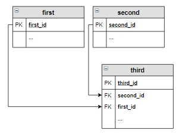

# Основы реляционной модели

## Отношение (таблица)

 Реляционная модель определяет способ представления данных (структуру данных), методы защиты данных (целостность данных), и операции, которые можно выполнять с данными (манипулирование данными).


*Отношение* - структура данных целиком, набор записей (иногда называют таблица)

*Кортеж* - каждая строка, содержащая данные (иногда называют запись)

*Мощность* - число кортежей в таблице

*Атрибут* - столбец в таблице (иногда называют поле)

*Размерность* - число атрибутов в таблице

*Домен атрибута* - допустимые значения, которые можно занести в поле

### Отношение, реляционная модель

Обязательным этапом перед созданием БД является ее проектирование.

Имя таблицы (отношения) должно быть уникальным в пределах БД. Рекомендуется существительное в единственном числе, понятное имя, описывающее моделируемый объект, имя должно быть короткое (до 10 символов).

Имя поля должно быть уникальным в пределах таблицы. Рекомендуется разделять составные имена подчеркиванием.

Ключевые поля должны состоять из двух частей: названия таблицы и `id`, например `book_id`.

### Типы данных полей

`int, integer` - целые числа (32 bit)

`decimal, numeric` - вещественное число, в скобках указывается максимальная длина числа. Например `decimal(6,3)` означает вещественное число с 6 цифрами в числе и 3 цифры после запятой, например для `decimal(6,3)` это `123,456`. 

`date` - дата в формате ГГГГ-ММ-ДД

`varchar` - строка длиной не более 255 символов в однобайтовой кодировке.

Для описания ключевого поля можно использовать `int primary key auto_increment`

### Создание таблицы

Для создания таблицы используется SQL-запрос. Ключевое слово `create table`. Пример запроса:

```sql
create table genre(
    genre_id int primary key auto_increment,
    name_genre varchar(30)
);
```

В конце sql-запроса ставится точка с запятой. Но для одного запроса это не обязательно.

### Вставка записи в таблицу

Для занесения новой записи в таблицу используется SQL-запрос, в котором указывается в какую таблицу, в какие поля заносить новые значения.

Пример запроса:

```sql
insert into table(field1, field2)
values (value1, value2);
```

В результате выполнения этого запроса новая запись добавится в конец указанной таблицы.

Рекомендуется заполнять все поля записи, если же поле пропущено, значение этого поля зависит от установленных по умолчанию значений, если значения не установлены, то вставляется `null`.

Значения поля `primary key auto_increment` формируется автоматически, т.е. его не нужно указывать при добавлении значения в таблицу.

---

## Выборка данных

### Выборка всех данных из таблицы

Для выборки данных из таблицы используется ключевое слово `select`. Также для выборки всех данных без указания атрибутов таблицы можно использовать знак `*`. Таким образом для выборки всех записей из таблицы используется запрос:

```sql
select * from table
```

### Выборка отдельных столбцов

Для выборки отдельных столбцов после ключевого слова `select` необходимо написать атрибуты, которые мы хотим видеть в выборке. Например:

```sql
select attribute1,
       attrubite2
from table;
```

### Выборка новых столбцов и присвоение им новых имен

Для того чтобы присвоить атрибуту новое имя используется ключевое слово `as`. Например:

```sql
select attribute1 as new_name_attribute1,
       attribute2
from table;
```

### Выборка данных с созданием вычисляемого столбца

Результатом выборки является таблица, в которую включены все данные из указанных после `select` столбцов, а также новый столбец, в каждой строке которого вычисляется заданное выражение.

Например:

```sql
select attribute1,
       attribute2,
       attribute3 * constant as new_attribute3
from table;
```

### Выборка данных, вычисляемые столбцы, математические функции

Некоторые из функций, реализованных в SQL:

1. `ceiling(x)` - округление до целого в большую сторону

2. `round(x,k)` - округление **x** до **k** знаков после запятой, если не указано **k**, то округлят до целого

3. `floor(x)` - округляет до целого числа в меньшую сторону

4. `power(x,y)` - возведение **x** в степень **y**

5. `sqrt(x)` - квадратный корень из **x**

6. `degrees(x)` - конвертирует значение **x** из радиан в градусы

7. `radians(x)` - конвертирует значение **и** из градусов в радианы

8. `abs(x)` - модуль числа **x**

9. `PI()` - число $\pi$

### Выборка данных, вычисляемые столбцы, логические функции

В SQL можно заносить в поле значение на основании условия. Для это применяют функцию `if()`:

```sql
if(expression, result_if_true, result_if_false)
```

### Выборка данных по условию

С помощью запросов можно включать в итоговую выборку не все строки исходной таблицы, а только те, которые соответствуют условию. Для этого после указания таблицы задается ключевое слово `where` и логическое выражение.

Операторы сравнения могут быть:

| Оператор | Значение         |
|:--------:|:----------------:|
| =        | равно            |
| <>       | не равно         |
| >        | больше           |
| <        | меньше           |
| >=       | больше или равно |
| <=       | меньше или равно |

Например:

```sql
select attribute1,
       attribute2,
from table
where attribute1 * constant1 >= contstant2;
```

### Выборка данных, логические операции

Логическое выражение может включать логические операции `and` ,`or` ,`not` и круглые скобки.

Приоритет операций:

1. Скобки

2. Умножение, деление

3. Сложение, вычитание

4. Операторы сравнения

5. `not`

6. `and`

7. `or`

Например:

```sql
select attribute1,
       attribute2,
from table
where attribute1 > constant1 and attribute2 = contstant2;
```

### Выборка данных, операторы between, in

Логические выражения могут включать операторы `between` и `in`. Приоритет этих операторов как у оператора `if`.

Оператор `between` отбирает данные, относящиеся к некоторому интервалу, включая границы.

Оператор `in` выбирает данные, соответствующие значениям из списка.

### Выборка данных с сортировкой

Для сортировки используется ключевое слово `order by`, после которого указываются имена столбцов. Строки сортируются по первому столбцу, а если указан второй, то сортировка происходит только для тех строк, у которых значение первого столбца одинаковы. По умолчанию сортировка при помощи `order by` происходит по возрастанию, чтобы указать порядок сортировки после имени столбца можно указать ключевое слово `asc` (по возрастанию) или `desc` (по убыванию).

Столбцы для `order by`  можно указывать названием столбца, номером столбца или псевдонимом (указанным после `as`).

### Выборка данных, оператор like

Оператор `like` используется для сравнения строк. Этот оператор позволяет сравнивать строки на неполное совпадение, а по шаблону. Шаблон может включать любой символ и *символ-шаблон* (`%` и `_`). Где `%` - строка любой длины, а `_` - любой одиночный символ.

Например `like '%M.%'` выберет все строки, содержащие `M.`, а `like 'Поэм_'` выберет все строки, начинающиеся с `Поэм` и заканчивающиеся любым символом.

---

## Запросы, групповые операции

### Выбор уникальных элементов столбца

Чтобы отобрать уникальные элементы используют ключевое слово `distinct` после `select`.

Например:

```sql
select distinct attribute1
from table;
```

Для этого также можно использовать оператор `group by`, который группирует данные при выборке с одинаковыми значениями.

Тот же пример, что и выше, но с использованием `group by`

```sql
select attribute1
from table
group by author;
```

В разделе `group by` также можно указывать несколько столбцов, разделяя их запятыми. Тогда к одной группе будут относиться записи, у которых значения столбцов, входящих в группу, равны.

Пример:

```sql
select name, number_plate, violation, count(*)
from fine
group by name, number_plate, violation;
```

### Выборка данных, групповые функции SUM и COUNT

При группировке можно выполнить действие с элементами, входящими в группу, например просуммировать все сгруппированные значения.

Пример группировки:

```sql
select attribute1, 
       sum(attribute2), 
       sum(attribute3)
from table
group by attribute1;
```

`sum` позволяет сложить элементы каждой группы, а `count` позволяет посчитать количество элементов в каждой группе.

`count(*)` - подсчитывает все записи в группе, в том числе со значением `null`.

`count(attribute)` - подсчитывает все записи в группе с условием `not null`.

В агрегатных функциях (таких как `sum` и `count`) можно использовать ключевое слово `distinct` для подсчета уникальных значений.

### Выборка данных, групповые функции MIN, MAX, AVG

К групповым функциям относят: `min()`, `max()`, `avg()`.

### Выборка данных с вычислением, групповые функции

В качестве аргумента групповой функции может использоваться любое допустимое в SQL арифметическое выражение.

Например:

```sql
select attribute1,
       sum(attribute2 * attribute3) as name
from table
group by attribute1;
```

Групповые функции могут быть элементами выражений. Т.е. можно написать 

```sql
round(sum(attribute2 * attribute3), 2)
```

### Вычисления по таблице целиком

Групповые функции можно применять к целому столбцу без группировки.

Например:

```sql
select sum(attribute)
from table;
```

Результатом таких запросов является единственная строка с вычисленными по таблице значениями.

### Выборка данных по условию, групповые функции

В запросы с групповыми функциями можно включать условие отбора строк. В таких запросах вместо `where` используется ключевое слово `having`, которое размещается после `group by`.

Например:

```sql
select attribute1,
       min(attribute2),
       max(attribute2)
from table
group by attribute1
having sum(attribute2 * attribute3) > constant1
```

Оптимизация от ChatGPT:

```sql
WITH temp AS (
  SELECT attribute1, attribute2, attribute3
  FROM table
  WHERE (attribute2 IS NOT NULL) AND (attribute3 IS NOT NULL)
)
SELECT attribute1, MIN(attribute2), MAX(attribute2)
FROM temp
GROUP BY attribute1
HAVING SUM(attribute2 * attribute3) > constant1;
```

### Выборка данных по условию, групповые функции, WHERE и HAVING

`where` и `having` могут использоваться в одном запросе. При этом необходимо учитывать порядок выполнения SQL-запроса:

1. FROM

2. WHERE

3. GROUP BY

4. HAVING

5. SELECT

6. ORDER BY

Например:

```sql
select author,
    min(price) as Minimum_price,
    max(price) as Maximum_price
from book
where author <> 'Есенин С.А.'
group by author
having sum(amount) > 10;
```

---

## Вложенные запросы

Вложенный запрос - запрос внутри другого запроса SQL.

Вложенный запрос используется для выборки данных, которые будут использоваться в условии отбора записей основного запроса. Его применяют для:

- сравнения выражения с результатом вложенного запроса

- определения того, включено ли выражение в результаты вложенного запроса

- проверки того, выбирает ли запрос определенные строки

Составляющие вложенного запроса:

- Ключевое слово `select` после которого указываются имена столбцов или выражения
- Ключевое слово `from` и имя таблицы
- Необязательное предложение `where`
- Необязательное предложение `group by` и `having`

Вложенные запросы могут включаться в `where` и `having` так:

- `where | having` expression *оператор сравнения* (вложенный запрос)
- `where | having` expression, включающее вложенный запрос
- `where | having` expression `[NOT] IN` (вложенный запрос)
- `where | having` expression *оператор сравнения* `ANY | ALL` (вложенный запрос)

Также вложенные запросы могут вставляться в основной запрос после ключевого слова `select`.

### Вложенный запрос, возвращающий одно значение

Такой запрос может использоваться в условии отбора записей `where` как обычное значение вместе с операторами сравнения.

Например:

```sql
select title, author, price, amount
from book
where price = (
         select min(price) 
         from book
      );
```

Этот запрос выводит информацию о самых дешевых книгах, хранящихся на складе.

### Использование вложенного запроса в выражении

Вложенный запрос, возвращающий одно значение, можно использовать в выражениях как обычный операнд.

Например:

```sql
select title, author, amount 
from book
where abs(amount - (select avg(amount) from book)) >3;
```

Этот запрос выведет информацию о книгах, количество экземпляров которых отличается от среднего количества экземпляров книг на складе более чем на 3.

### Вложенный запрос, оператор IN

Вложенный запрос может возвращать несколько значений одного столбца. Тогда его можно использовать внутри оператора `in`.

```sql
where name_of_attribute in (subquery)
```

Например:

```sql
select title, author, amount, price
from book
where author in (
        select author 
        from book 
        group by author 
        having sum(amount) >= 12
      );
```

Этот запрос выводит информацию о книгах тех авторов, общее количество экземпляров книг которых не менее 12.

### Вложенный запрос, операторы ANY и ALL

Вложенный запрос, возвращающий несколько значений одного столбца можно использовать для отбора записей с помощью операторов `ANY` и `ALL` совместно с операциями сравнения.

Операторы `ANY` и `ALL` используются для сравнения некоторого значения с результирующим набором вложенного запроса, состоящим из одного столбца.

При использовании `ANY` в результирующую таблицу будут включены все записи, для которых выражение со знаком сравнения верно хотя бы для одного элемента результирующего запроса.

Работа `ANY`:

- `amount > ANY(10,12)` эквивалентно `amount > 10`

- `amount < ANY(10,12)` эквивалентно `amount < 12`

- `amount = ANY(10,12)` эквивалентно `amount IN (10,12)` или `(amount = 10) or (amount = 12)`

- `amount <> ANY(10,12)` вернет все записи с любым значением, включая 10 и 12.

При использовании оператора `ALL` в результирующую таблицу будут включены все записи, для которых выражение со знаком сравнения верно для всех элементов результирующего запроса.

Работа `ALL`:

- `amount > ALL(10,12)` эквивалентно `amount > 12`

- `amount < ALL(10,12)` эквивалентно `amount < 10`

- `amount = ALL(10,12)` эквивалентно `(amount = 10) and (amount = 12)` такая запись ничего не вернет

- `amount <> ALL(10,12)` вернет все записи кроме тех, где amount равно 10 или 12

Операторы `ALL` и `ANY` можно использовать **только с вложенными запросами**.

Например:

```sql
select title, author, amount, price
from book
where amount < all(
        select avg(amount) 
        from book 
        group by author 
      );
```

Этот запрос выведет информацию о тех книгах, количество которых меньше самого маленького среднего количества книг каждого автора.

## Вложенный запрос после SELECT

В этом случае результат выполнения запроса выводится в отдельном столбце результирующей таблицы. При этом результатом запроса может быть только одно значение, тогда оно будет повторяться во всех строках. Также вложенный запрос может использоваться в выражениях.

Например:

```sql
select title, author, amount, 
    (
     select avg(amount) 
     from book
    ) as Среднее_количество 
from book
where abs(amount - (select avg(amount) from book)) >3;
```

Данный запрос выводит информацию о книгах, количество экземпляров которых отличается от среднего количества экземпляров книга на складе более чем на 3.

---

## Запросы корректировки данных

### Создание пустой таблицы

Создание таблицы осуществляется с помощью запроса `create`.

### Добавлений записей в таблицу

Добавление одной записи в таблицу осуществляется с помощью запроса `insert`.

Допускается вставка нескольких записей одновременно, для этого используется запрос такого вида:

```sql
insert into table_name(attribute1, attribute2, ..., attributeN)
values
    (value1_1, value1_2, ..., value1_N),
    (value2_1, value2_2, ..., value2_N),
    ...
    (valueM_1, valueM_2, ..., valueM_N);
```

Пример:

```sql
insert into book (title, author, price, amount) 
values 
    ('Война и мир','Толстой Л.Н.', 1070.20, 2),
    ('Анна Каренина', 'Толстой Л.Н.', 599.90, 3);
```

### Добавление записей из другой таблицы

Вместо раздела `values` записывается запрос на выборку, начинающийся с `select`. В нем можно использовать `where, group by, order by`.

Правила соответствия между полями таблицы и вставляемыми значениями из запроса:

1. Количество полей в таблице и количество полей в запросе должны совпадать

2. Должно существовать прямое соответствие между позицией одного и того же элемента в обоих списках, поэтому первый столбец запроса должен относиться к первому столбцу в списке столбцов таблицы, второй - ко второму и т.д.

3. Типы столбцов запроса должны быть совместимы с типами данных соответствующих столбцов таблицы.

Например:

```sql
insert into book (title, author, price, amount) 
select title, author, price, amount 
from supply;
```

Этот запрос вносит все книги из таблицы `supply` в таблицу `book`.

### Добавление записей, вложенные запросы

В запросах на добавление можно использовать вложенные запросы.

Например:

```sql
insert into book (title, author, price, amount) 
select title, author, price, amount 
from supply
where title not in(
        select title 
        from book
      );

select * from book;
```

Этот запрос вносит в таблицу book записи из таблицы supply, которые отсутствуют в book.

### Запросы на обновление

Обновление данных - изменение существующих записей в таблице. Изменение записей доступно с помощью запроса `update`.

Пример:

```sql
update table_name set field = expression;
```

С помощью запросов на обновление можно изменять не все записи в таблице, а только часть из них. Для этого в запрос добавляют `where`, после которого указывается условие отбора строк для изменения.

Пример:

```sql
update book
set price = 0.7 * price
where amount < 5;
```

### Запросы на обновление нескольких столбцов

Пример:

```sql
update table_name set field1 = expression1, field2 = expression2
```

Пример:

```sql
update 
    book 
set 
    buy = if (buy > amount, amount, buy), 
    price = if (buy = 0, price * 0.9, price);
```

### Запросы на обновление нескольких таблиц

В запросах на обновление можно использовать несколько таблиц, но тогда:

- Для столбцов, имеющих одинаковые имена, необходимо указывать имя таблицы, к которой они относятся (например `book.price` или `supply.price`)

- Все таблицы, используемые в запросе, нужно перечислить после ключевого слова `update`

- В запросе обязательно условие `where`, в котором указывается условие при котором обновляются данные

Пример:

```sql
update book, supply 
SET book.amount = book.amount + supply.amount
WHERE book.title = supply.title AND book.author = supply.author;
```

### Запросы на удаление

Запросы корректировки данных позволяют удалить одну или несколько записей из таблицы. 

Пример:

```sql
delete from table_name
```

Этот запрос удаляет все записи из указанной таблицы.

Удалять можно по условию.

Пример:

```sql
delete from table_name
where condition;
```

### Запросы на создание таблицы

Новая таблица может быть создана на основе данных из другой таблицы. Для этого используется запрос `select`, результирующая таблица которого и будет новой таблицей базы данных.

Пример:

```sql
create table table_name as
select ...
```

Пример:

```sql
create table ordering as
select author, title, 5 as amount
from book
where amount < 4;
```

Этот запрос создает таблицу заказ, куда включает авторов и название тех книг, количество экземпляров которых в таблице book меньше 4 и устанавливает количество экземпляров равным 5.

При создании таблицы можно использовать вложенные запросы после `select` и `where`.

Пример:

```sql
create table ordering as
select author,
       title,
       (select round(avg(amount))
       from book) as amount
from book
where amount < 4;
```

## Запросы на выборку

### Оператор LIMIT

Используется для ограничения вывода записей. Результирующая таблица будет иметь количество строк не более указанного после `limit`. `limit` размещается после раздела `order by`.

Пример:

```sql
select *
from trip
order by date_first
limit 1;
```

### Работа с датами

Для вычитания двух дат используется функция `datediff(date1, date2)`. Результатом является количество дней между date1 и date2.

Пример:

```sql
DATEDIFF('2020-04-01', '2020-03-28')=4
DATEDIFF('2020-05-09','2020-05-01')=8
```

Для того, чтобы выделить номер месяца из даты используется функция `month(date)`.

Пример:

```sql
month('2020-04-12')=4
```

Для выделения названия месяца из даты используется функция `monthname(date)`, которая возвращает название месяца на английском языке для указанной даты.

Пример:

```sql
monthname('2020-04-12')='April'
```

### Использование временного имени (алиаса)

Алиас - псевдоним, который присваивается столбцам или таблицам. Есть 2 варианта присваивания:

1. С использованием ключевого слова `as`
   
   ```sql
   from table_name as t
   ```

2. Без ключевого слова `as`
   
   ```sql
   from table_name t
   ```

После присвоения таблице алиаса его можно использовать во всех разделах запроса.

Пример:

```sql
select  f.name, f.number_plate, f.violation, 
   if(
    f.sum_fine = tv.sum_fine, "Стандартная сумма штрафа", 
    if(
      f.sum_fine < tv.sum_fine, "Уменьшенная сумма штрафа", "Увеличенная сумма штрафа"
    )
  ) as description               
from  fine f, traffic_violation tv
where tv.violation = f.violation and f.sum_fine is not NULL;
```

---

# Запросы SQL к связанным таблицам

## Связи между таблицами

Средствами SQL запросов можно выбирать и обрабатывать данные не только из одной таблицы, но из нескольких связанных таблиц.

### Связь "один ко многим"

Рассмотрим таблицу book:

| book_id | title                 | name_author      | price  | amount |
| ------- | --------------------- | ---------------- | ------ | ------ |
| 1       | Мастер и Маргарита    | Булгаков М.А.    | 670.99 | 3      |
| 2       | Белая гвардия         | Булгаков М.А.    | 540.50 | 5      |
| 3       | Идиот                 | Достоевский Ф.М. | 460.00 | 10     |
| 4       | Браться Карамазовы    | Достоевский Ф.М. | 799.01 | 2      |
| 5       | Стихотворения и Поэмы | Есенин С.А.      | 650.00 | 15     |

В этой таблице фамилии авторов повторяются для нескольких книг. А что, если придется вместо инициалов для каждого автора хранить его полное имя и отчество? Тогда, если в таблице содержится информация о 50 книгах Достоевского, придется 50 раз исправлять «Ф.М.» на «Федор Михайлович». При этом, если в некоторых записях использовать «Фёдор Михайлович» (c буквой ё), то мы вообще получим двух разных авторов...

Чтобы устранить эту проблему в реляционных БД создается новая таблица `author`, в которой перечисляются все различные авторы, а затем эта таблица связывается с таблицей `book`. При этом такая связь называется **"один ко многим"**, таблицы `author` называется главной, таблица `book` - связанной или подчиненной.

Связь **"один ко многим"** имеет место, когда одной записи главной таблицы соответствует несколько записей связанной таблицы, а каждой записи связанной таблицы соответствует только одна запись главной таблицы.

Обозначается это так:

```
[Автор] --> [Книга]
```

Чтобы реализовать связь **"один ко многим"** для нашего примера (где автор может написать несколько книг, а одна книга написана только одним автором) необходимо:

1. Создать таблицу `author`, в которую включить уникальных авторов книг, хранящихся на складе
   
   

2. Обе таблицы должны содержать первичный ключ, в таблице `book` он уже есть, а в таблице `author` добавим ключ `author_id`
   
   

3. Включим в таблицу `book` связанный столбец (внешний ключ, `foreign key`) соответствующий по имени и типу ключевому столбцу главной таблицы (в нашем случае это `author_id`)
   
   

### Связь "многие ко многим"

Есть книги, написанные двумя и более авторами, для таких книг связь **"один ко многим"** не подходит. 

Для таких случаев используется связь **многие ко многим**.

Связь **"многие ко многим"** имеет место когда каждой записи одной таблицы соответствует несколько записей во второй, и наоборот, каждой записи второй таблицы, соответствует несколько записей в первой.

Обозначается это так:

```
[Автор] <--> [Книга]
```

Чтобы реализовать связь **"многие ко многим"** нужно:

1. Создать таблицу `author`, в которую включить уникальных авторов книг, хранящихся на складе
   
   

2. В обеих таблицах необходимо определить первичный ключ, в таблице `book` он уже есть, а для таблицы `author` он будет `author_id `
   
   

3. Создать новую *таблицу-связку*, состоящую из двух столбцов, соответствующих по имени и типу ключевым столбцам исходных таблиц. Каждый из этих столбцов является внешним ключом (`foreign key`) и связан с ключевым столбцом каждой таблицы. 
   
   

4. Определяемся с первичным ключом *таблицы-связки*. Можно сделать два ключевых столбца, тогда все записи в этой таблице должны быть уникальными, то есть не повторяться. Для связи автор-книга это подходит, но в некоторых случаях записи в таблице-связке могут повторяться, например, если мы будем продавать книги покупателям (один человек может купить несколько книг, а одну и ту же книгу могут купить несколько человек). Тогда в *таблицу-связку* включают дополнительные столбцы для идентификации записей, например, дату продажи, также в таблицу-связку добавляют первичный ключ. Второй вариант предпочтительнее.
   
   

### Создание таблицы с внешними ключами

При создании зависимой таблицы (таблицы, которая содержит внешние ключи) необходимо учитывать, что:

- каждый внешний ключ должен иметь такой же тип данных, как связанное поле главной таблицы

- необходимо указать главную для нее таблицу и столбец, по которому осуществляется связь
  
  ```sql
  foreign key (связанное_поле_зависимой_таблицы)  
  references главная_таблица (связанное_поле_главной_таблицы)
  ```

Пример добавления внешнего ключа:

```sql
foreign key (author_id) references author (author_id)
```

По умолчанию любой столбец, кроме ключевого, может содержать значение `null`. При создании таблицы это можно переопределить, используя ограничение `not null` для этого столбца:

```sql
create table table_name (
    attribute1 int not null,
    attribute2 varchar(10)  
);
```

В созданной таблице `attribute1` не может быть `null`, а `attribute2` может.

Для внешних ключей рекомендуется устанавливать ограничение `not null` (если это совместимо с другими опциями).

### Действия при удалении записи главной таблицы

С помощью выражения `on delete` можно установить действия, которые выполняются для записей подчиненной таблицы при удалении связанной строки из главной таблицы. При удалении можно установить следующие опции:

- `cascade` - автоматически удаляет строки из зависимой таблицы при удалении связанных строк в главной таблице

- `set null` - при удалении связанной строки из главной таблицы устанавливает для столбца внешнего ключа значение `null` (в этом случае столбец внешнего ключа должен поддерживать установку `null`)

- `set default` - значение внешнего ключа устанавливается в значение по умолчанию для данного столбца

- `restrict` - отклоняет удаление строк в главной таблице при наличии связанных строк в зависимой таблице

Например, будем считать сто при удалении автора из таблицы `author` необходимо удалить все записи о его книгах из таблицы `book`. Это действие необходимо прописать при создании таблицы:

```sql
create table book (
    book_id int primary key auto_increment, 
    title varchar(50), 
    author_id int not null, 
    price decimal(8,2), 
    amount int, 
    foreign key (author_id) references author (author_id) on delete cascade
);
```

## Запросы на выборку, соединение таблиц

В SQL запросах могут участвовать несколько таблиц БД. При этом необходимо указать, как эти таблицы соединены между собой.

Операция соединения `join` предназначена для обеспечения выборки данных из двух таблиц и включения этих данных в один результирующий набор. При необходимости соединения не двух, а нескольких таблиц, операция соединения применяется несколько раз (последовательно).

Операторы соединения входят в раздел `from` SQL запросов.

### Соединение INNER JOIN

Оператор внутреннего соединения `inner join` соединяет две таблицы. Порядок таблиц для оператора неважен, поскольку оператор симметричен. В условии пишется условие сопоставление каких-либо атрибутов первой и второй таблицы.

Пример:

```sql
select
    *
from
    table_name1 inner join table_name2
    on condition
```

Результат запроса сформируется по следующему алгоритму:

1. Каждая строка одной таблицы сопоставляется с каждой строкой второй таблицы

2. Для получения соединенной строки проверяется условие соединения

3. если условие истинно, в таблицу результата добавляется соответствующая "соединенная" строка

Пример:

```sql
select
    title,
    name_genre,
    price
from
    book inner join genre
on genre.genre_id = book.genre_id
where book.amount > 8
order by price desc;
```

Запрос выводит название, жанр и цену тех книг, количество которых больше 8, в отсортированном по убыванию цены виде.

### Внешнее соединение LEFT и RIGHT OUTER JOIN

Оператор внешнего соединения `LEFT OUTER JOIN` (или просто `LEFT JOIN`) соединяет две таблицы. Порядок таблиц для оператора важен, поскольку оператор несимметричен.

Пример:

```sql
select
    *
from
    table_name1 left join table_name2
on
    condition
```

Результат формируется по следующему алгоритму:

1. В результат включается внутренне соединение (`inner join`) первой и второй таблицы в соответствии с условием

2. Затем в результат добавляются те записи первой таблицы (второй для `right join`), которые не вошли во внутреннее соединение на шаге 1, для таких записей соответствующие поля второй таблицы заполняются `null`.

Пример:

```sql
select
    name_genre
from
    genre left join book
on
    genre.genre_id = book.genre_id
where
    title is null;
```

Запрос выводит все жанры, которые не представлены на складе.

### Перекрестное соединение CROSS JOIN

Этот оператор также называется декартовым произведением, соединяет две таблицы (в запросе вместо `cross join` можно указать `,` между таблицами). Порядок таблиц неважен - оператор симметричен.

Пример:

```sql
select
    *
from
    table_name1 cross join table_name2 ИЛИ (table_name1, table_name2)
```

Результат запроса формируется так: каждая строка одной таблицы соединяется с каждой строкой другой таблицы, формируя в результате все возможные сочетания строк двух таблиц.

Пример:

```sql
select
    name_author,
    name_genre
from
    author cross join genre    
```

Этот запрос каждому автору из таблицы `author` поставит в соответствие все возможные жанры из таблицы `genre`.

### Запросы на выборку из нескольких таблиц

Запрос на выборку может выбирать данные из двух и более таблиц БД, которые логически связаны между собой. Для каждой пары таблиц, включаемых в запрос, необходимо указать свой оператор соединения. Наиболее распространенным является внутренне `inner join` соединение.

Пример:


```sql
select
    *
from
    first
    inner join second on first.first_id = second.first_id
    inner join third on second.secnd_id = third.secnd_id
```

Пример:



```sql
select
    *
from
    first
    inner join third on first.first_id = third.first_id
    inner join second in third.second_id = second.second_id
```

В этом случае рекомендуется соединение таблиц записывать последовательно, "по кругу": `first -> third -> second`.

Пример:

```sql
select
    title,
    name_author,
    name_genre,
    price,
    amount
from
    author 
    inner join book on author.author_id = book.author_id
    inner join genre on genre.genre_id = book.genre_id
where price between 500 and 700;
```

Этот запрос выводит информацию о тех книгах, авторах и жанрах, цена которых принадлежит интервалу от 500 до 700 рублей включительно.

### Запросы для нескольких таблиц с группировкой

В запросах с групповыми функциями могут использоваться несколько таблиц, между которыми используются различные типы соединений.

Пример:

```sql
select
    name_author,
    count(title) as Количество
from 
    author inner join book
    on author.author_id = book.author_id
group by 
    name_author
order by 
    name_author;    
```

Запрос выводит количество различных книг каждого автора.

При использовании `inner join` мы не можем узнать, что какие-то книги отсутствуют на складе, но предполагается, что они могут быть. Чтобы автор, не представленный на складе был включен в результат необходимо изменить способ соединения таблиц.

Пример:

```sql
select
    name_author,
    count(title) as Количество
from 
    author left join book
    on author.author_id = book.author_id
group by 
    name_author
order by 
    name_author;
```

### Запросы для нескольких таблиц со вложенными запросами

В запросах, построенных на нескольких таблицах, можно использовать вложенные запросы. Вложенный запрос может быть включен: после ключевого слова `select`, после `from` и в условие обора после `where(having)`.

Пример:

Вывести авторов, общее количество книг которых на складе максимально.

Шаг 1: Найти суммарное количество книг на складе по каждому автору

```sql
select 
    author_id, 
    sum(amount) as sum_amount 
FROM 
    book 
GROUP BY 
    author_id;
```

Шаг 2: Находим  максимальное значение из прошлого шага

```sql
select 
    max(sum_amount) as max_sum_amount
from 
    (
     select author_id, sum(amount) as sum_amount 
     from book 
     group by author_id
    ) query_in
```

В этом запросе таблица из шага 1 используется в качестве источника данных с именем `query_in`.

Шаг 3: Выведем фамилию автора и общее количество книг для него

```sql
select 
    name_author, 
    sum(amount) as Количество
from 
    author inner join book
    on author.author_id = book.author_id
group by 
    name_author
```

Шаг 4:

Включим запрос из шага 2 в условие обора запроса с шага 3, и получим всех авторов, общее количество книг максимально.

```sql
select 
    name_author, 
    sum(amount) as Количество
from 
    author inner join book
    on author.author_id = book.author_id
group by 
    name_author
having sum(amount) = 
     (/* считаем максимальное из общего количества книг каждого автора */
      SELECT MAX(sum_amount) AS max_sum_amount
      FROM 
          (/* считаем количество книг каждого автора */
            SELECT author_id, SUM(amount) AS sum_amount 
            FROM book GROUP BY author_id
          ) query_in
      );
```

### Вложенные запросы в операторах соединения

Синтаксис:

```sql
select
    *
from
    table_name1 join
        (
        select 
            *
        from
            ...
        ) name_of_inner_query
    on condition
...
```

Вложенный запрос может стоять как справа, так и слева от оператора join. Допускается использование двух запросов в операторах соединения.

Пример:

Вывести авторов, пишущих книги в самом популярном жанре (количество книг в этом жанре на складе максимально)

Шаг 1: Находим общее количество книг по каждому жанру, сортируем по убыванию и оставляем одну запись

```sql
select
    genre_id, 
    sum(amount) as sum_amount
from
    book
group by 
    genre_id
order by
    sum_amount desc
limit 1
```

Шаг 2: Найдем id самых популярных жанров используя запрос из 1 шага

```sql
select query_in_1.genre_id
from 
    (/* выбираем код жанра и количество произведений, относящихся к нему */
      select
          genre_id, 
          sum(amount) as sum_amount
      from 
          book
      group by 
          genre_id 
    )query_in_1
    inner join
    (/* выбираем запись, в которой указан код жанр с максимальным количеством книг */
      select 
          genre_id, 
          sum(amount) as sum_amount
      from 
          book
      group by
          genre_id
      order by
          sum_amount desc
      LIMIT 1
     ) query_in_2
     on query_in_1.sum_amount=query_in_2.sum_amount;
```

Шаг 3. Используя запрос с шага 2, выведем фамилии авторов, которые пишут в самых популярных жанрах, и названия этих жанров. Группировка дб осуществлена по автору и id жанра.

```sql
select  name_author, name_genre
from 
    author 
    inner join book on author.author_id = book.author_id
    inner join genre on book.genre_id = genre.genre_id
group by author.name_author, genre.name_genre, genre.genre_id
having genre.genre_id in
         (/* выбираем автора, если он пишет книги в самых популярных жанрах*/
          select query_in_1.genre_id
          from 
              ( /* выбираем код жанра и количество произведений, относящихся к нему */
                select genre_id, sum(amount) as sum_amount
                from book
                group by genre_id
               )query_in_1
          inner join 
              ( /* выбираем запись, в которой указан код жанр с максимальным количеством книг */
                select genre_id, sum(amount) as sum_amount
                from book
                group by genre_id
                order by sum_amount desc
                limit 1
               ) query_in_2
          on query_in_1.sum_amount=query_in_2.sum_amount
         );   
```

### Операция соединение, использование USING

При описании соединения таблиц с помощью `join` в некоторых случаях вместо `on` и следующего за ним условия можно использовать оператор `using`. 

`using` позволяет указать набор столбцов, которые есть в обеих объединяемых таблицах. Если база данных хорошо спроектирована, а каждый внешний ключ имеет такое же имя, как и соответствующий первичный ключ (например `genre.genr._id = book.genre_id`), тогда можно использовать `using` для реализации операции `join`.

При этом после `select`, при использовании столбцов из `using`, необязательно указывать, из какой именно таблицы берется столбец.

Пример:

```sql
Вариант с ON:
select
    title,
    name_author,
    author.author_id
from
    author inner join book
    on author.author_id = book.author_id;


Вариант с USING:
select
    title,
    name_author,
    author_id
from
    author inner join book
    using(author_id);
```

Запись условия соединения с использованием `on` более гибко, поскольку позволяет:

- задавать соединение не только по одноименным полям

- использовать произвольное условие на соединение таблиц, при этом в условие может включаться произвольное выражение, например, можно указать два или более столбца

## Запросы корректировки, соединение таблиц

С помощью запросов корректировки данных решим задачу о занесении в базу книг, привезенных на склад поставщиком.

### Запросы на обновление, связанные таблицы

В запросах на обновление можно использовать связанные таблицы. Исправлять данные можно во всех таблицах, участвующих в запросе.

```sql
update 
    table_name1 join table_name2
    on expression
set ...
where ...    
```

Пример:

Для книг, которые уже есть на складе (в таблице `book`) по той же цене, что и в поставке (`supply`), увеличить количество на значение, указанное в поставке, а также обнулить количество этих книг в поставке.

```sql
update 
    book inner join author on author.author_id = book.author_id
    inner join supply on book.title = supply.title 
    and supply.author = author.name_author
set
    book.amount = book.amount + supply.amount,
    supply.amount = 0   
where
    book.price = supply.price;
```

### Запросы на добавление, связанные таблицы

Запросом на добавление можно добавить записи, отобранные с помощью запроса на выборку, который включает несколько таблиц:

```sql
insert into 
    table_name1(attribute_list)
select
    (attribute_list_from_another_tables)
from
    table_name2 join table_name3
    on ...
    ...    
```

Пример:

В таблице `supply`  есть новые книги, которых на складе еще не было. Прежде чем добавлять их в таблицу `book`,  необходимо из таблицы `supply`отобрать новых авторов, если таковые имеются.

```sql
insert into
    author
select
    supply.author
from
    author 
    right join supply on author.name_author = supply.author
where name_author is null;
```

### Запрос на обновление, вложенные запросы

Пример:

```sql
update
    book
set 
    genre_id = 1
where
    book_id = 9;
```

### Каскадное удаление записей связанных таблиц

При создании таблицы для внешних ключей с помощью `on delete` устанавливаются опции, которые определяют действия, выполняемые при удалении связанной строки из главной таблицы.

`on delete cascade` автоматически удаляет строки из зависимой таблицы при удалении связанных строк в главной таблице.

Пример:

В таблице `book` эта опция установлена для поля `author_id`.

```sql
delete from
    author
where 
    name_author like "Д%";
```

### Удаление записей главной таблицы с сохранением записей в зависимой

При создании таблицы для внешних ключей с помощью `on delete` устанавливают действия, выполняемые при удалении связанной строки из главной таблицы.

Если задано `set null`, то при удалении связанной строки из главной таблицы в зависимой, в столбце внешнего ключа устанавливается значение `null`.

Пример:

В таблице `book` эта опция установлена на поле `genre_id`. Удалим из таблицы `genre` все жанры, название которых заканчивается на "я", а в таблице `book` для этих жанров установим значение `null`.

```sql
delete from
    genre
where
    name_genre like "%я";
```

### Удаление записей, использование связанных таблиц

При удалении записей из таблицы можно использовать информацию из других связанных с ней таблиц. В этом случае синтаксис запроса имеет вид:

```sql
delete from
    table_name1
using
    table_name1 inner join table_name2
    on ...
where
    ...
```

Пример:

Удалить всех авторов из таблицы `author`, у которых есть книги, количество экземпляров которых меньше 3. Из таблицы `book` удалить все книги этих авторов.

```sql
delete from 
    author
using
    author inner join book 
    on author.author_id = book.author_id
where book.amount < 3;
```
